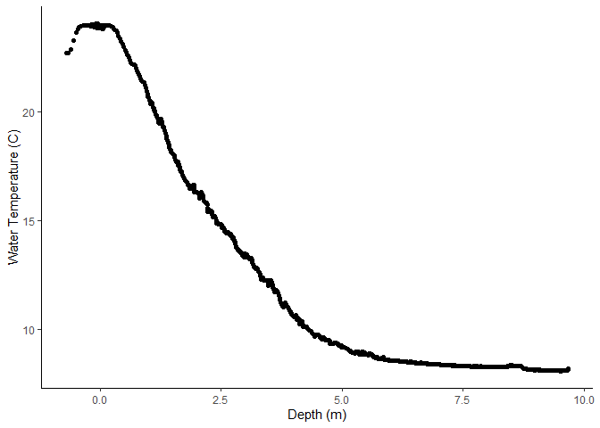
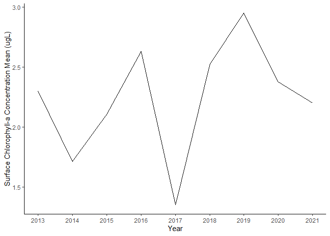
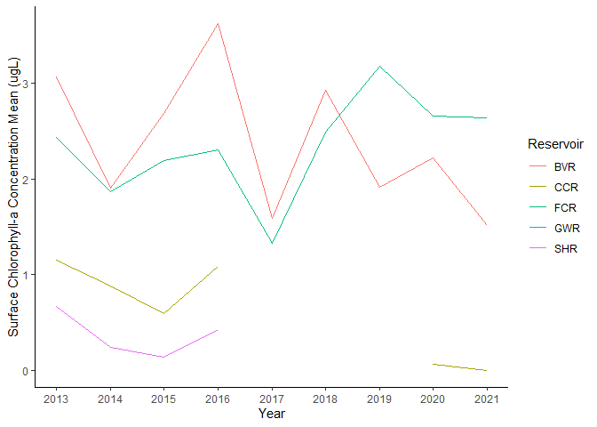
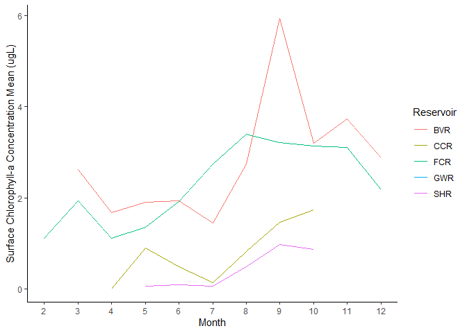
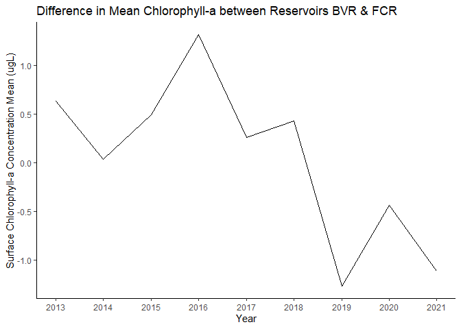

Introduction to Tidyverse Module
================
Quinn Thomas

This module represent the “Whole Game” for data science in R. In this
module you will be importing, tidying, transforming, visualizing, and
communicating environmental data. If you have used Tidyverse previously,
then this module is a review. If you have not used Tidyverse previously
then you will use the links to the “R for Data Science” book to learn
the skills that you need to complete the module.

Be sure to load the following packages

``` r
#install packages("tidyverse")
library(tidyverse)
```

    ## ── Attaching packages ─────────────────────────────────────── tidyverse 1.3.2 ──
    ## ✔ ggplot2 3.4.0      ✔ purrr   1.0.1 
    ## ✔ tibble  3.1.8      ✔ dplyr   1.0.10
    ## ✔ tidyr   1.2.1      ✔ stringr 1.5.0 
    ## ✔ readr   2.1.3      ✔ forcats 0.5.2 
    ## ── Conflicts ────────────────────────────────────────── tidyverse_conflicts() ──
    ## ✖ dplyr::filter() masks stats::filter()
    ## ✖ dplyr::lag()    masks stats::lag()

``` r
library(lubridate)
```

    ## Loading required package: timechange
    ## 
    ## Attaching package: 'lubridate'
    ## 
    ## The following objects are masked from 'package:base':
    ## 
    ##     date, intersect, setdiff, union

The Reservoir column is different reservoirs in the Roanoke, VA area
that a set of water quality variables have been measured.

- Description of data set:
  <https://portal.edirepository.org/nis/metadataviewer?packageid=edi.200.12>
- Data:
  <https://pasta.lternet.edu/package/data/eml/edi/200/12/0a62d1946e8d9a511bc1404e69e59b8c>

**Warming-up**

Read the data file into R. This file is directly streamed in R memory
from a url, rather than downloaded and saved locally.

``` r
df <- read_csv("https://pasta.lternet.edu/package/data/eml/edi/200/12/0a62d1946e8d9a511bc1404e69e59b8c")
```

    ## Rows: 996363 Columns: 25
    ## ── Column specification ────────────────────────────────────────────────────────
    ## Delimiter: ","
    ## chr   (1): Reservoir
    ## dbl  (23): Site, Depth_m, Temp_C, DO_mgL, DO_pSat, Cond_uScm, Spec_Cond_uScm...
    ## dttm  (1): Date
    ## 
    ## ℹ Use `spec()` to retrieve the full column specification for this data.
    ## ℹ Specify the column types or set `show_col_types = FALSE` to quiet this message.

``` r
#file_name <- "https://pasta.lternet.edu/package/data/eml/edi/200/12/0a62d1946e8d9a511bc1404e69e59b8c"

#download.file(url = file_name, destfile = "data_raw/assignment2_water_quality_raw.csv", method = "curl")


#df <- read_csv(“data_raw/assignment2_water_quality_raw.csv”)
```

# Excerise 1

The first exercise is focused on data visualization so you will start
with a filtered dataset named `df2`. This subsetted dataset is for a
particular location (`Site == 50`) for a particular Reservoir
(`Reservoir == "FCR"`)

``` r
df2 <- df |> 
  filter(Reservoir == "FCR" & Site == 50 & Date == as_datetime("2021-05-28 10:48:31"))

#how to find number of rows and columns
nrow(df)
```

    ## [1] 996363

``` r
nrow(df2)
```

    ## [1] 1058

``` r
ncol(df)
```

    ## [1] 25

``` r
ncol(df2)
```

    ## [1] 25

## Question 1:

- Describe the data set that was imported above (`df`) to the best of
  your ability given the documentation provided: what are the columns
  and units? Where do the numbers come from?

\#Q1 Answer: Within df, there are 996363 observations. There are 25
columns: Reservoir (name of reservoir), Site (site number of each data
point), Date (ymd & time), Depth (meters), Temperature (celcius),
dissolved oxygen (mgl), dissolved oxygen (pSat), conductivity (uscm),
specific conductance (uScm), chlorophyll-a (ugL), water turbidity, water
pH, reduction potential (mV), Photosynthetically active radiation
(umolm2s), descent rate (m/s). The numbers are data collected from
technologies of specific points at a site in a reservoir of a certain
characteristic (such as depth, temperature, surface chlorophyll-a.

- What value is used for missing values? What is the interpretation of
  missing values?

\#Q2 Answer: The value “NA” is used for missing values. “NA” stands for
nonapplicable, so anytime a function is run on any NA values, R cannot
compute and it will output another NA.

## Question 2

[Plot](https://r4ds.hadley.nz/data-visualize.html#two-numerical-variables)
and *describe* the relationship between temperature and depth. What
might explain the pattern? Hint: use the point geom

``` r
#Gives a quick view of the data table
head(df2)
```

    ## # A tibble: 6 × 25
    ##   Reservoir  Site Date                Depth_m Temp_C DO_mgL DO_pSat Cond_uScm
    ##   <chr>     <dbl> <dttm>                <dbl>  <dbl>  <dbl>   <dbl>     <dbl>
    ## 1 FCR          50 2021-05-28 10:48:31  -0.693   22.7     NA      NA        NA
    ## 2 FCR          50 2021-05-28 10:48:31  -0.693   22.7     NA      NA        NA
    ## 3 FCR          50 2021-05-28 10:48:31  -0.693   22.7     NA      NA        NA
    ## 4 FCR          50 2021-05-28 10:48:31  -0.693   22.7     NA      NA        NA
    ## 5 FCR          50 2021-05-28 10:48:31  -0.692   22.7     NA      NA        NA
    ## 6 FCR          50 2021-05-28 10:48:31  -0.687   22.7     NA      NA        NA
    ## # … with 17 more variables: Spec_Cond_uScm <dbl>, Chla_ugL <dbl>,
    ## #   Turb_NTU <dbl>, pH <dbl>, ORP_mV <dbl>, PAR_umolm2s <dbl>, Desc_rate <dbl>,
    ## #   Flag_Temp <dbl>, Flag_DO <dbl>, Flag_Cond <dbl>, Flag_SpecCond <dbl>,
    ## #   Flag_Chla <dbl>, Flag_Turb <dbl>, Flag_pH <dbl>, Flag_ORP <dbl>,
    ## #   Flag_PAR <dbl>, Flag_DescRate <dbl>

``` r
ggplot(df2, aes(x = Depth_m, y = Temp_C)) + 
  geom_point() +
  labs(x = "Depth (m)", y = "Water Temperature (C)") +
  theme_classic()
```

<!-- -->

``` r
#Answer: The water temperature closest to the surface is typically greater than the water temperature at higher depths. This might be explained by the water's exposure to the sun. The water at the surface is in more direct sunlight therefore being exposed to more heat from the sun, whereas the water at higher depths are gradually being exposed to less and less sunlight, which explains the downward curve of the graph as depth increases. 
```

# Exercise 2

Exercise 2 is focused on cleaning up the full dataset. Initially, you
will be using the full dataset (`df`). You will be using the `filter`,
`select`, `rename`, and `mutate` functions.

## Question 3

We are only interested in the `Chla_ugL` at the surface of each
reservoir. [Filter](https://r4ds.hadley.nz/data-transform.html#filter)
the dataset (`df`) to only include measurements less than 1 m deep and
[select](https://r4ds.hadley.nz/data-transform.html#sec-select) only the
reservoir, site, date, depth, and chlorophyll-a columns. Remember the
filtering is done on rows and selecting is done on columns.

## Question 4

The column name `Date` is not an accurate name for the column because it
include the time of day as well.
[Rename](https://r4ds.hadley.nz/data-transform.html#rename) the column
to `datetime` and save the updated data frame.

``` r
#3
df3 <- df |> filter(Depth_m < 1) |> select(Reservoir:Depth_m, Chla_ugL)

#4
df3 <- df3 |> rename("datetime" = `Date`)
```

## Question 5

In the analysis below, you will need a column that is the year. Apply
the function
[`year()`](https://r4ds.hadley.nz/datetimes.html#date-time-components)
from the lubridate package to the `datetime` column and save the updated
data frame. Hint: you will use the `year` function within the [`mutate`
function](https://r4ds.hadley.nz/data-transform.html#sec-mutate)

``` r
df3 <- df3 |> mutate(year = year(datetime))
```

## Question 6

In the analysis below, you will need a column that is the month. Apply
the function
[`month()`](https://r4ds.hadley.nz/datetimes.html#date-time-components)
from the lubridate package to the `datetime` column and save the updated
data frame. Hint: you will use the [`mutate`
function](https://r4ds.hadley.nz/data-transform.html#sec-mutate)

``` r
df3 <- df3 |> mutate(month = month(datetime))
```

## Question 7

To finalize your cleaned dataset, order the values in the columns by
Reservoir (A-Z). Hint: use
[`arrange`](https://r4ds.hadley.nz/data-transform.html#arrange)

``` r
df3 <- df3 |> arrange(Reservoir)
```

# Exercise 3

Exercise 3 is focused on high level summary statistics.

## Question 8

How many different reservoirs are in the dataset and what are their
names? Hint: use the
[`distinct`](https://r4ds.hadley.nz/data-transform.html#distinct)
function

``` r
df3 |> distinct(Reservoir)
```

    ## # A tibble: 5 × 1
    ##   Reservoir
    ##   <chr>    
    ## 1 BVR      
    ## 2 CCR      
    ## 3 FCR      
    ## 4 GWR      
    ## 5 SHR

``` r
#Answer: There are 5 different reservoirs known as "BVR", "CCR", "FCR", "GWR", and "SHR."
```

## Question 9

Which reservoir has the highest mean surface chlorophyll-a? Hint: use
`group_by()` and `summarize()`
[combination](https://r4ds.hadley.nz/data-transform.html#groups)

``` r
df3 |> group_by(Reservoir) |> summarize(meanChla = mean(Chla_ugL, na.rm = TRUE))
```

    ## # A tibble: 5 × 2
    ##   Reservoir meanChla
    ##   <chr>        <dbl>
    ## 1 BVR          2.52 
    ## 2 CCR          0.508
    ## 3 FCR          2.53 
    ## 4 GWR          3.22 
    ## 5 SHR          0.297

``` r
#Answer: Reservoir GWR has the highest mean surface chlorophyll-a of 3.2247313. 
```

## Question 10

Which reservoir has the highest observed surface chlorophyll-a?

``` r
df3 |> group_by(Reservoir) |> summarize(maxChla = max(Chla_ugL, na.rm = TRUE))
```

    ## # A tibble: 5 × 2
    ##   Reservoir maxChla
    ##   <chr>       <dbl>
    ## 1 BVR         20.7 
    ## 2 CCR         19.5 
    ## 3 FCR        258.  
    ## 4 GWR          4.42
    ## 5 SHR          1.04

``` r
#Answer: Reservoir FCR has the highest observed surface chlorophyll-a of 258.2027. 
```

# Exercise 4

Exercise 4 dives deeper into the data.

## Question 11

Plot the surface chlorophyll-a concentration for each year (averaged
across reservoirs) and describe how surface chlorophyll-a is changing
over time.

``` r
df3 |> group_by(year) |> 
  summarize(meanChla = mean(Chla_ugL, na.rm = TRUE)) |> 
  ggplot(aes(year, meanChla)) + 
  geom_line() +
  scale_x_continuous(breaks = seq(2013, 2022, by = 1)) +
  theme_classic() +
  labs(x = "Year", y = "Surface Chlorophyll-a Concentration Mean (ugL)")
```

<!-- -->

``` r
#Answer:  The surface chlorophyll-a concentration (averaged across reservoirs) appears to be alternating between high and low every 1-2 years. 
```

## Question 12

Plot the annual mean surface chlorophyll-a concentration for each year
for each reservoir and describe how the patterns differ from the plot in
Question 11.

``` r
df3 |> group_by(year, Reservoir) |> 
  summarize(meanChla = mean(Chla_ugL, na.rm = TRUE)) |> 
  ggplot(aes(year, meanChla, color = Reservoir)) + 
  geom_line() +
  scale_x_continuous(breaks = seq(2013, 2022, by = 1)) +
  theme_classic() +
  labs(x = "Year", y = "Surface Chlorophyll-a Concentration Mean (ugL)")
```

    ## `summarise()` has grouped output by 'year'. You can override using the
    ## `.groups` argument.

<!-- -->

``` r
#Answer: When the data points are separated by their respective reservoir, you can see that the trends are more consistent within each reservoir. For example, in the graph in question 11, the data line is going from high to low, but in this graph, reservoir BVR and FCR are at a relatively high value but reservoir SHR, GWR, and SHR are relatively low, so there is a clear separation which makes the plot more meaningful and easier to analyze. 
```

## Question 13

Plot the mean surface chlorophyll-a concentration by month for each
reservoir and describe how the month of peak chlorophyll-a is similar or
different across the reservoirs.

``` r
df3 |> group_by(month, Reservoir) |> 
  summarize(meanChla = mean(Chla_ugL, na.rm = TRUE)) |> 
  ggplot(aes(month, meanChla, color = Reservoir)) + 
  geom_line() +
  scale_x_continuous(breaks = seq(2, 12, by = 1)) +
  theme_classic() +
  labs(x = "Month", y = "Surface Chlorophyll-a Concentration Mean (ugL)")
```

    ## `summarise()` has grouped output by 'month'. You can override using the
    ## `.groups` argument.

<!-- -->

``` r
#Answer: When looking at the reservoir measurements comparatively, they seem to follow the same trends with the chlorophyll-a concentrations lower in early and later months and the chlorophyll-a concentrations increasing and peaking during the summer months. In September particulary, all of the reservoirs show a spike in chlorophyll-a concentration. 
```

# Exercise 5

Two of the reservoirs are close in distance to each other (FCR and BVR).
We are interested in how the mean annual surface chlorophyll-a differs
between the two and how that difference changes over time.

## Question 14:

Plot the difference in the annual mean chlorophyll-a between `BVR` and
`FCR`. Hints: you will need to use `group_by`, `summarize`,
[`pivot_wider`](https://r4ds.hadley.nz/data-tidy.html#widening-data),
and `mutate` to get the cleaned dataset from Exercise 3 into a table
that can be used generate this plot.

``` r
df3_w <- df3 |> group_by(year, Reservoir) |> 
  summarize(meanChla = mean(Chla_ugL, na.rm = TRUE))
```

    ## `summarise()` has grouped output by 'year'. You can override using the
    ## `.groups` argument.

``` r
df3_w <- df3_w |> pivot_wider(names_from = Reservoir, values_from = meanChla)

df3_w <- df3_w |> mutate(BVR_FCR = BVR - FCR)

ggplot(df3_w, aes(year, BVR_FCR)) + 
  geom_line() +
  scale_x_continuous(breaks = seq(2013, 2022, by = 1)) +
  theme_classic() +
  labs(x = "Year", y = "Surface Chlorophyll-a Concentration Mean (ugL)") + 
  ggtitle("Difference in Mean Chlorophyll-a between Reservoirs BVR & FCR")
```

<!-- -->

# Exercise 6

This exercise is focused on exporting the data and a plot

## Question 15

Save the plot from Question 14 to a PNG named `question-14.png` in your
repo top-level directory. Hint: use
[ggsave()](https://r4ds.hadley.nz/data-visualize.html#sec-ggsave)

``` r
ggplot(df3_w, aes(year, BVR_FCR)) + 
  geom_line() +
  scale_x_continuous(breaks = seq(2013, 2022, by = 1)) +
  theme_classic() +
  labs(x = "Year", y = "Surface Chlorophyll-a Concentration Mean (ugL)") + 
  ggtitle("Difference in Mean Chlorophyll-a between Reservoirs BVR & FCR")
```

<!-- -->

``` r
ggsave(filename = "question-14.png")
```

    ## Saving 7 x 5 in image

## Question 16

Write your cleaned data frame to your repo top-level directory with the
filename of `introduction-cleaned-data.csv`. Hint use
[`write_csv()`](https://r4ds.hadley.nz/data-import.html#sec-writing-to-a-file)

``` r
write_csv(df3, "introduction-cleaned-data.csv")
```

Remember to Knit your document as a `github_document` and comment+push
your code and knitted document to GitHub.
